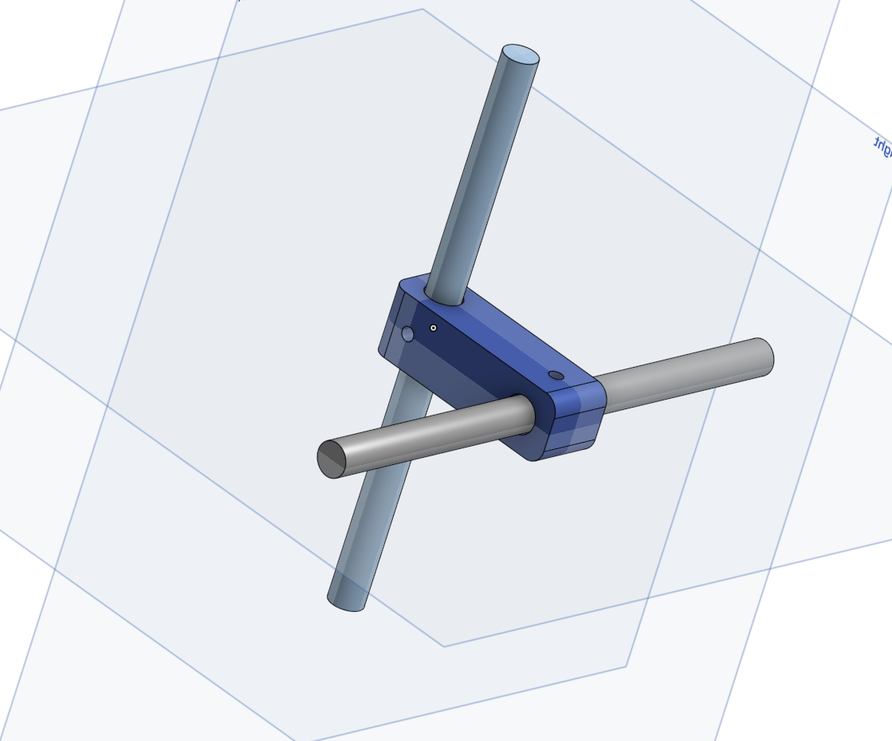
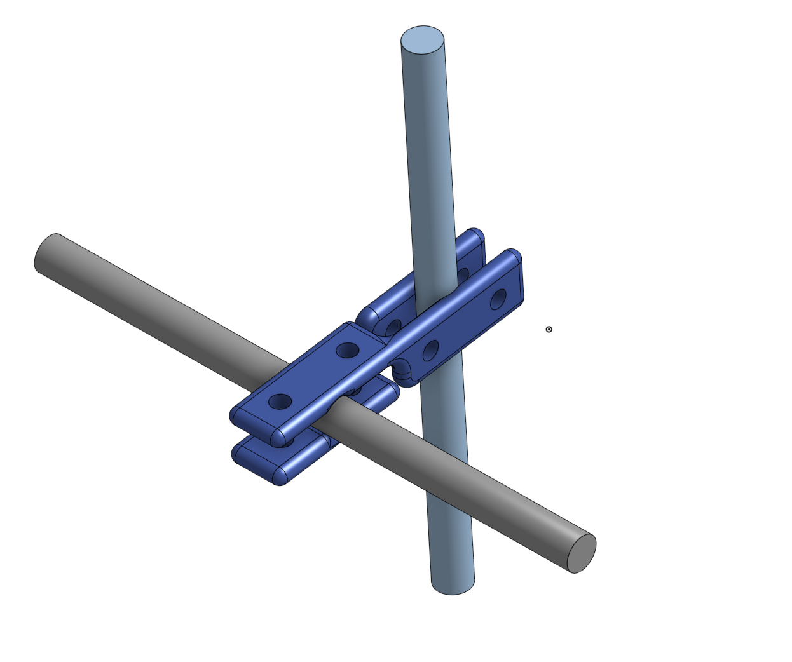

# 3D Stereotaxis Clamp
Design two different clamp to mount two 6mm diammeter 100mm length row crossed in 1' center-to-cebter distances.

Project is stored in onshape.com. [3D Stereotaxis Clamp](https://cad.onshape.com/documents/a8c7f20ab2a20d5b2520332b/w/851b8f3ee7b9396f650c6acd/e/b86a1ebf91dcee6d072c80cf?renderMode=0&uiState=6811c4ca3f319f11fbfef790)

### Design 1

This design is sample to have two holes to let rols go through, and uisng M3 screw to stabilize.

The 3D print will be the best way to do prototype. I will using a FDM 3D printer to run a quick prototype.
For small scale order, like 100 pics, the 3D print tech will also be the best way to do that. I will using SLS Nylon metals through supplier like wenext.com for cheap parts.

##### Bom
| Parts | Quantity | Unit Price | Total Price |
| :---: | :---: | :---: | :---: |
| [3D Part](design_1.stl) | 1 | $1.81 | $1.81 |
| M3 5mm Screw([91290A110](https://www.mcmaster.com/products/screws/length~5-mm/)) | 2 | $0.12 | $0.24 |
|  |  |  | $2.05 |
* 3D print quote SLS PA12 from wenext.com

### Design 2

This design is using 2 rotated pieces of flate piece with screw holes on it to mount them. it do require at least 3 sets of screw and bolt to stabilize those two roles. (4 sets of screw and bolt will be suggested.)

The 3D print will be the best way to do prototype. I will using a FDM 3D printer to run a quick prototype too.
For small scale order, like 100 pics, 3D print through supplier like wenext.com will be one option, but I will searching to see if there is any banding metal sheet supplier can make the same things. 

##### Bom
| Parts | Quantity | Unit Price | Total Price |
| :---: | :---: | :---: | :---: |
| [3D Part](design_1.stl) | 2 | $0.51 | $1.02 |
| M3 5mm Screw([91290A110](https://www.mcmaster.com/products/screws/length~5-mm/)) | 4 | $0.12 | $0.48 |
| M3 Nuts([93418A200](https://www.mcmaster.com/products/screws/thread-pitch~0-5-mm-2/weld-nuts-2~/)) | 4 | $0.12 | $0.48 |
|  |  |  | $1.98 |
* 3D print quote SLS PA12 from wenext.com, but PA12 may not be strong enough.

### Tools
* Onshape: draw desing
* VS Code: text editor
